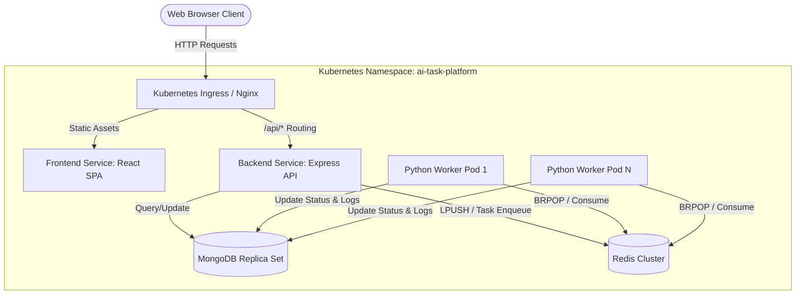

# Architecture Design Document
## AI Task Processing Platform (MERN + Python Background Worker)

---

## 1. System Architecture Overview

The AI Task Processing Platform is designed as a highly scalable, decoupled, event-driven system. It separates synchronous user interaction (handled by a Node.js/Express web API) from heavy text processing workloads (handled asynchronously by a Python worker daemon).



### Component Details
1. **Frontend Service (React.js)**: A responsive Single Page Application (SPA) served by Nginx. Users authenticate, submit tasks, monitor status, and view execution metrics. It uses polling on task state transitions (`pending` -> `running` -> `success` / `failed`) to render changes in real time.
2. **Backend API Service (Express.js)**: A stateless web server that exposes endpoints for Authentication (JWT-based) and Task Management. It performs rate-limiting, handles requests, inserts tasks into MongoDB as `pending` states, and pushes corresponding task IDs onto the Redis queue (`task_queue`).
3. **Queue Service (Redis)**: Act as the message bus. A Redis list (`task_queue`) coordinates tasks between the Express backend and the Python background worker pool. This isolates spike traffic from worker utilization.
4. **Background Worker (Python)**: An independent daemon executing text operations (`uppercase`, `lowercase`, `reverse`, `word_count`). It connects directly to MongoDB (using PyMongo) and Redis (using redis-py). It blocks via `BRPOP` on the Redis queue, transitions task states, processes tasks, captures stdout/stderr execution logs, and records metrics.
5. **Database (MongoDB)**: Used as the single source of truth for persistent data, storing User accounts, Task statuses, results, metadata, and task execution logs.

---

## 2. Worker Scaling Strategy

To handle varying workloads cost-effectively, the Python background worker is designed for horizontal scaling using Kubernetes **Horizontal Pod Autoscaling (HPA)**.

### Auto-Scaling Metrics
* **CPU/Memory Utilization**: HPA is configured to autoscale workers between 1 and 5 replicas (expandable in production) when the average CPU utilization exceeds **75%**.
* **Queue-Length Metrics (Recommended Production addition)**: For a pure event-driven queue, standard CPU metrics can lag. A custom metrics API (using Prometheus and KEDA - Kubernetes Event-driven Autoscaling) scales workers based on the number of waiting items in the Redis `task_queue`:
  $$\text{Replicas} = \lceil \frac{\text{Queue Length}}{\text{Target Tasks Per Worker}} \rceil$$
  For example, if the queue length exceeds 50 items, KEDA triggers immediate spin-up of additional worker pods.

### Graceful Shutdown
To prevent task loss or database corruption during scale-down, Python workers capture `SIGTERM` and `SIGINT` signals. Upon receiving a shutdown signal:
1. The worker stops pulling new tasks from the Redis queue.
2. It completes the current task in progress.
3. It updates the database, releases resources (closes connections), and exits cleanly.
4. If a task takes longer than the Kubernetes grace period (default 30s), the task can be safely timed out and requeued, or the termination grace period can be extended (`terminationGracePeriodSeconds: 60`).

---

## 3. High Volume Task Processing (100,000 Tasks/Day)

Processing 100,000 tasks/day translates to:
* **Average rate**: $\approx 1.16\text{ tasks/second}$
* **Peak rate**: $\approx 5\text{ to }10\text{ tasks/second}$ (assuming 5x-10x spikes during working hours)

### Scaling Architecture for High Volume
1. **Decoupled Event Stream**: Pushing task IDs onto a Redis list (`task_queue`) is an $O(1)$ operation that finishes in micro-seconds. The Express API does not block waiting for the Python worker, ensuring the web interface remains fast and responsive.
2. **Connection Pooling**:
   * **Mongoose**: Configured with connection pool size (`maxPoolSize: 50`) to handle concurrent requests.
   * **PyMongo**: Utilizes internal connection pools within each worker pod, preventing connection overhead on every database write.
3. **Database Write Aggregation**: Task creation write, running status update, and success/failure results write are isolated. The database handles $\approx 3.48$ writes/second on average, which MongoDB easily handles on standard single-node or replica set setups.
4. **Redis Performance**: Redis is single-threaded and executes memory-based commands. A single Redis instance easily handles up to 50,000+ operations/second, making the 100k/day load negligible for the queue layer.

---

## 4. MongoDB Indexing Strategy

To support fast dashboard queries and high task volume writes, we implement the following indexing strategy:

```javascript
// Index on TaskSchema (defined in models/Task.js)
TaskSchema.index({ userId: 1, createdAt: -1 });
```

### Rationale
1. **Single-Field index vs. Compound Index**: The dashboard table queries tasks filtered by the logged-in user's `userId` and displays them sorted by time (`createdAt` descending) to show recent items first:
   `db.tasks.find({ userId: userId }).sort({ createdAt: -1 })`
   Without a compound index `{ userId: 1, createdAt: -1 }`, MongoDB would perform a collection scan or index intersection, followed by an expensive in-memory sort. With this index, the query uses the index to filter and retrieve documents in pre-sorted order, completing in $O(\log N)$ time.
2. **Task Lookup by ID**: Finding individual tasks by `_id` (e.g. for worker processing and details modal lookup) is automatically indexed by MongoDB's default primary key index `_id: 1`.

---

## 5. Redis Failure Handling & Recovery Strategy

Redis holds the transient task queue. If Redis crashes or network partition occurs, we protect data integrity through these strategies:

### 1. Persistence Configuration
We enable **Append Only File (AOF)** persistence alongside RDB snapshots:
* `appendonly yes`: Logs every write operation received by the server.
* `appendfsync everysec`: Syncs writes to disk once per second, limiting data loss to at most 1 second of queued tasks during a hard crash.

### 2. Backend Fallback & Error Handling
* The Node.js Express backend monitors the Redis client connection using connection event listeners.
* If Redis goes offline, the Express API catches the failure, logs the incident, and gracefully switches to a degraded state. Rather than crashing, it saves the task to MongoDB with a `failed` status and returns an informative error message: `503 Service Unavailable - Worker Queue is Offline`.

### 3. Worker Reconnection Loop
The Python worker implements a resilient try-except loop:
* If a connection error occurs during a `BRPOP` operation, the worker logs a warning and enters a retry loop with exponential backoff (e.g. 5s, 10s, 20s).
* Once Redis comes back online, the worker automatically reconnects and resumes task consumption.

---

## 6. Deployment Strategy

We deploy using a phased pipeline across separate environments:

```
[ Developer Commit ] ──> [ CI Pipeline (Github Actions) ]
                                 │
                                 ├──> Builds & Lints
                                 └──> Pushes Tags
                                         │
                                         ▼
                             [ Infra Git Repo Update ]
                                 │
                                 ▼
                     [ ArgoCD GitOps Reconciliation ]
                                 │
                   ┌─────────────┴─────────────┐
                   ▼                           ▼
         [ Staging Cluster ]          [ Production Cluster ]
```

### Staging Environment
* **Infrastructure**: Standard single-node Kubernetes cluster (e.g. k3s / minikube).
* **Databases**: Local containerized MongoDB and Redis instances.
* **Auto-Sync**: Argo CD is configured with full **Auto Sync** and **Prune** enabled, ensuring that any commit to the staging branch of the Infrastructure Repository is immediately deployed.
* **Purpose**: Performance profiling, integration verification, and security verification.

### Production Environment
* **Infrastructure**: Multi-node Managed Kubernetes cluster (e.g. EKS / GKE) distributed across Availability Zones.
* **Databases**: Enterprise-grade external databases (e.g. MongoDB Atlas Replica Set and Redis Enterprise / AWS ElastiCache) for high availability, backup restoration, and monitoring.
* **Release Flow (Progressive Delivery)**:
  * **Manual Sync / GitOps Approval**: Argo CD Auto Sync is disabled or restricted to manual gatekeeper approval for production releases.
  * **Blue-Green Deployments**: Backend and Frontend updates use a Blue-Green deployment strategy. The new version (Green) is deployed and health-checked. Once ready, Kubernetes Ingress routes traffic to Green, and the old version (Blue) is scaled down.
  * **Worker Rolling Update**: Workers are updated using `RollingUpdate` with `maxUnavailable: 0` and `maxSurge: 1`. This ensures there is always at least one active worker processing the queue during deployments.
